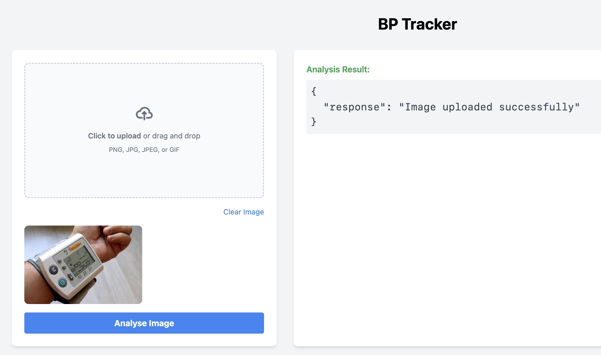
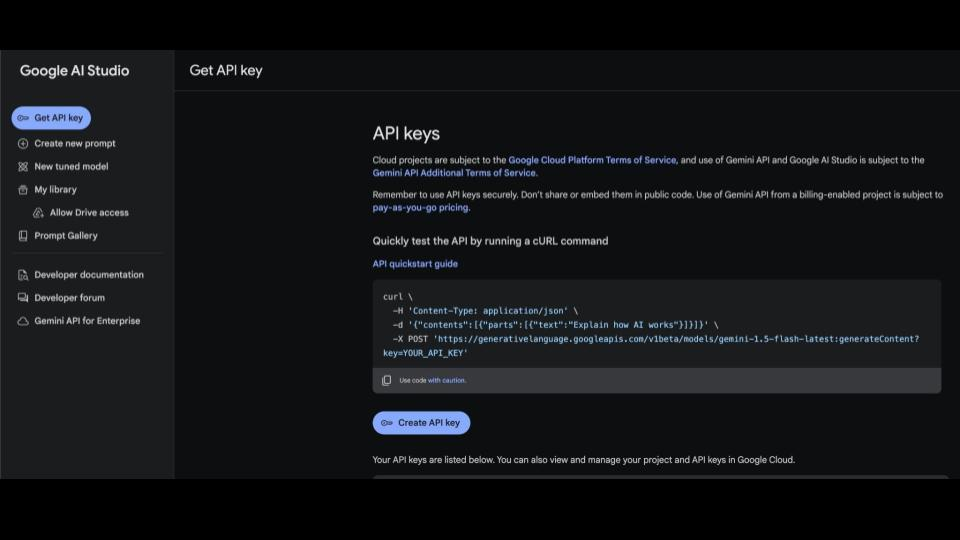
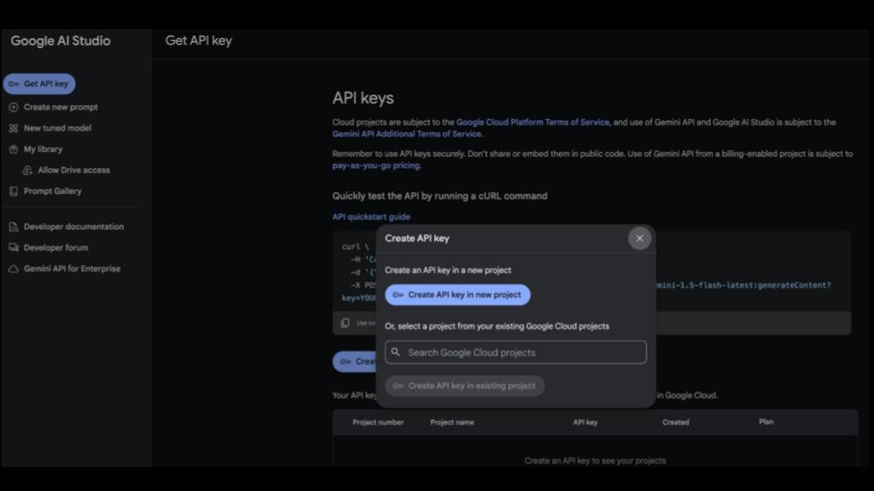
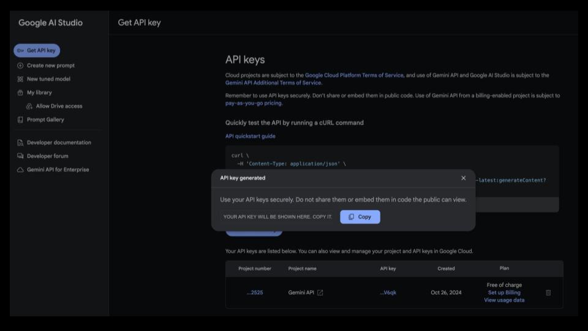
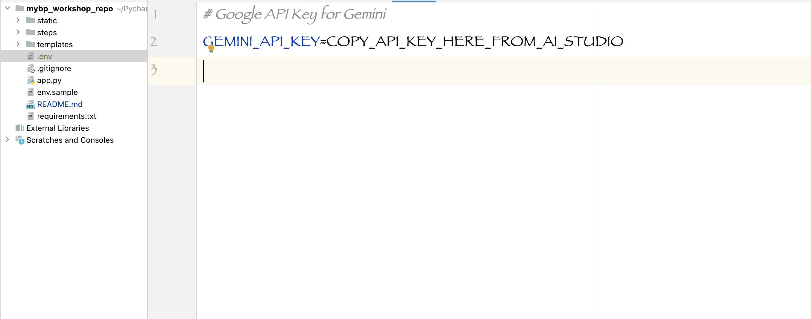
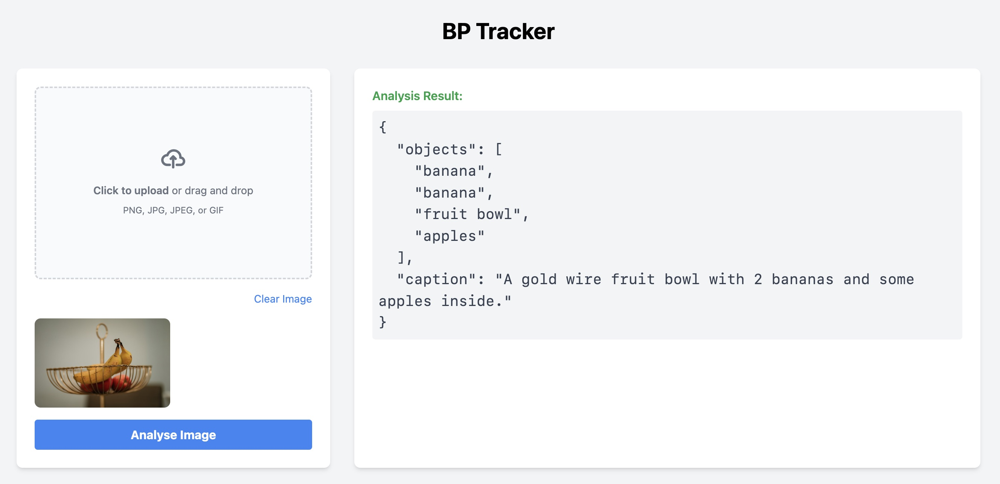
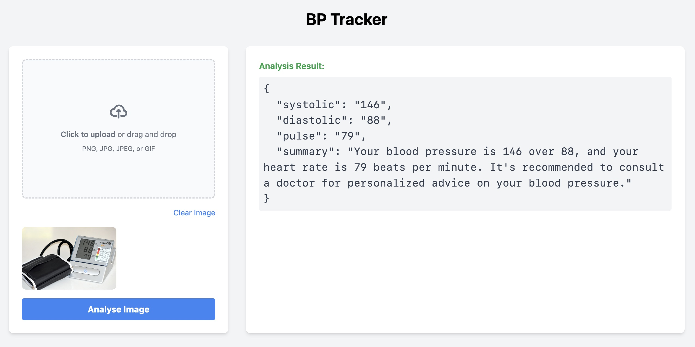
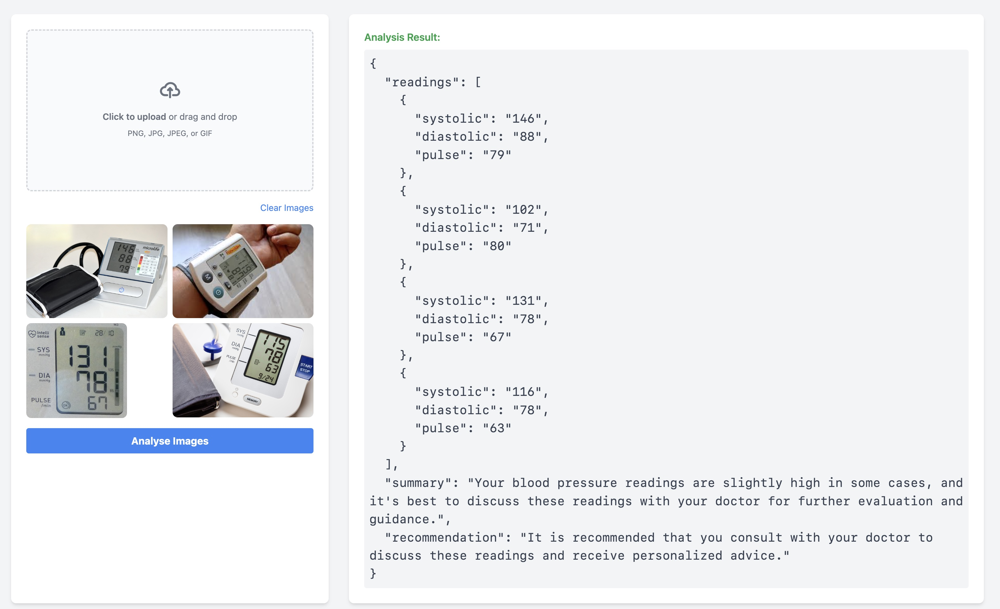

# Workshop: Building a Blood Pressure Monitor Image Analysis App

In this workshop, we'll build a Flask application that uses Google's Gemini AI to analyze images of blood pressure monitors, extract and analyze blood pressure readings, and handle multiple readings in a single request and provide a summary of the readings and recommendations. 

We will also deploy the app to a Google Cloud Run service so it's publicly accessible and would automatically scale out to handle multiple requests and scale in when demand decreases.

We'll go through four steps, each building upon the previous one.

## Prerequisites

- Python 3.9+ Visit [Python.org](https://www.python.org/downloads/) to download and install Python.
- Basic knowledge of Python, Flask, and HTML
- Google Cloud Project with Gemini API access 
- Google Cloud Credits -  <a href="https://trygcp.dev/e/build-ai-NA01">https://trygcp.dev/e/build-ai-NA01</a>


## Step 1: Basic Flask App with Image Upload

In this step, we'll create a basic Flask app that allows users to upload an image.

1. Let's start by cloning the base repository that contains the basic Flask app, sample images and the requirements.txt file that lists the dependencies.

```bash
git clone https://github.com/dftaiwo/bp-workshop.git
```
This repository contains the basic Flask app that we'll build upon in the subsequent steps.
2. Navigate to the project directory:

```bash
cd bp-workshop
```

3. Setup the Python3.9+ virtual environment:

```bash
python3.9 -m venv venv
```
If you have higher than 3.9, you can replace `python3.9` with `python` or `python3.10` or `python3.12` etc.

4. Please note that you will need to activate the virtual environment in your shell.

```bash
source venv/bin/activate
```

For Windows, you can activate the virtual environment by running:

```bash
venv\Scripts\activate
```

5. Install the required dependencies:
To install, run the following pip command:

```bash
pip install -r requirements.txt
```
PS: If you don't have pip installed, you can install it by following the instructions <a href="https://pip.pypa.io/en/stable/installation/" target="_blank">here</a>. 
Once pip is installed, you can run the above command to install the dependencies.

Just in case you are wondering, here are the contents of the `requirements.txt` file.
```txt
Flask>=2.0.0
gunicorn
python-dotenv==1.0.0
google-generativeai>=0.3.0
Pillow
```

6. Let's run and test the app:

```bash
python app.py
```

You should see a similar output:

```bash
* Serving Flask app 'app'
 * Debug mode: on
WARNING: This is a development server. Do not use it in a production deployment. Use a production WSGI server instead.
 * Running on http://127.0.0.1:5000
Press CTRL+C to quit
 * Restarting with stat
 * Debugger is active!
```

Now you have a hot reloading server running on port 5000, which means that any changes you make to the code will be reflected in the browser automatically, without the need to restart the server. However if the code breaks or the url is not loading, you may need to restart the server.


7. Open your browser and navigate to `http://127.0.0.1:5000/` <a href="http://127.0.0.1:5000/" target="_blank">http://127.0.0.1:5000/</a> and upload an image to see the app in action. 



Check the analyze route in `app.py` to see how the image is processed.
```python
def analyze():
    #let's have some basic validation
    if 'file' not in request.files:
        return jsonify({"error": "No file part"})
    
    file = request.files['file']
    if file.filename == '':
        return jsonify({"error": "No selected file"})
    
    if not file or not allowed_file(file):
        return jsonify({"error": "Invalid file type"})

    # A valid image is uploaded.
    response = {"result": '{"response": "Image uploaded successfully"}'}
    return jsonify(response)
```

For now, the app does not do anything with the image. We'll build upon this in the next step.

## Step 2: Image Analysis with Google's Gemini API
In this  step, we'll use Google's Gemini API to analyze the image.

To use the Gemini API, you need an API key. You can create a key with a few clicks in Google AI Studio.

1. Go to the <a href="https://aistudio.google.com/app/apikey" target="_blank">Google AI Studio</a> and follow the instructions to create an API key.




2. Save the API key in a file called `.env` in the root of the project.
```env
GEMINI_API_KEY=<your-api-key>
```


You should not commit this `.env` file to your repository as it contains sensitive information. This is best practice for security reasons.

3. We need to import the Gemini API client and configure it with our API key.
In the import section of `app.py`, add the following:
```python
from dotenv import load_dotenv
import google.generativeai as genai
```


So the top of the app.py file should look like this now
```python
import os
from flask import Flask, render_template, request, jsonify
from PIL import Image
import io
from dotenv import load_dotenv
import google.generativeai as genai

```

4. After the `app` variable declaration, add the following:

```python
# Load environment variables
load_dotenv()
# Set up Gemini API
genai.configure(api_key=os.getenv('GEMINI_API_KEY'))
model = genai.GenerativeModel('gemini-1.5-flash')
```
This will configure the Gemini API and set up the `model` variable we will use to analyze the image.

5. Let's replace the `analyze` route to use the Gemini API to analyze the image and also define the `analyze_image` function.

```python
def analyze():
    if 'file' not in request.files:
        return jsonify({"error": "No file part"})
    
    file = request.files['file']
    if file.filename == '':
        return jsonify({"error": "No selected file"})
    
    if not file or not allowed_file(file):
        return jsonify({"error": "Invalid file type"})

    # A valid image is uploaded, so now let's process it
    image_data = Image.open(file.stream)
    response = analyze_image(image_data)            
    return jsonify({"result": response.text})


def analyze_image(image):
    prompt = "Describe the image"
    return model.generate_content([prompt, image],
        generation_config=genai.GenerationConfig(
            response_mime_type="application/json"
        )
    )
```

6. Let's test the app by uploading an image.  Right now, the app will return a JSON response with the image description. 

**Two key thngs to note:**
- Remember, since we are using hot-reload, you don't need to restart the server.
- Since the prompt is "Describe the image", you can upload any image (of a car, a crowd, a street, a blood pressure reading etc) to see a description of it. There are images in the `static/images/readings` folder to test with. Here's an example of a random image:




## Step 3: Extracting and Analyzing Blood Pressure Readings
For this step, we'll use the Gemini API to **extract and analyze** blood pressure readings from an image.

We will do this by providing a prompt to the Gemini API that describes the task we want it to perform.

Therefore, the only thing we need to change is the **prompt**.

```python
def analyze_image(image):
    prompt = "Analyze the attached image of a digital blood pressure monitor. Extract the following three key values from the display:\
1. **Systolic**: The upper blood pressure reading (usually the larger number).\
2. **Diastolic**: The lower blood pressure reading (usually the smaller number).\
3. **Pulse**: The heart rate reading, typically labeled as Pulse or represented by a heart symbol.\
High level summary for a non-medical person, easy to understand in one sentence, followed by another sentence with a recommendation on what to do next, if any\
Provide the results in a JSON object with the following keys: systolic, diastolic, pulse, summary"

    return model.generate_content([prompt, image],
        generation_config=genai.GenerationConfig(
            response_mime_type="application/json"
        )
    )
```

6. Let's test the app by uploading an image of a blood pressure reading (sample images are in the `static/images/readings` folder). Right now, the app will return a JSON response with the blood pressure readings and a summary.




## Step 4: Handling and Processing Multiple Images

In this step, we'll modify the app to handle and process multiple readings in a single request.

1. First we will update the html file in `templates/index.html` to allow for multiple image uploads.
replace the input tag for the single image upload to accept multiple files.
Change from this:

```html
<input id="file-upload" type="file" name="file" class="hidden" accept="image/*" required/>
```

to this:        
```html
<input id="file-upload" type="file" name="files[]" class="hidden" accept="image/*" multiple required/>
```


2. We will replace the `analyze` route with a new one that will accept multiple image uploads and pass that to the `analyze_multiple_images` function we will define.
```python
def analyze():
    if 'files[]' not in request.files:
        return jsonify({"error": "No files uploaded"})
    
    files = request.files.getlist('files[]')
    if not files or files[0].filename == '':
        return jsonify({"error": "No selected files"})
    
    images = []
    for file in files:
        if file and allowed_file(file):
            image_data = Image.open(file.stream)
            images.append(image_data)
    
    if not images:
        return jsonify({"error": "No valid image files"})
    
    response = analyze_multiple_images(images)
    return jsonify({"result": response.text})
```

3. We will define the `analyze_multiple_images` function that will take the list of images and pass them to the Gemini API.

```python   
def analyze_multiple_images(images):
    prompt = "Analyze the attached images of digital blood pressure monitors. For each image, extract the following three key values from the display:\
1. **Systolic**: The upper blood pressure reading (usually the larger number).\
2. **Diastolic**: The lower blood pressure reading (usually the smaller number).\
3. **Pulse**: The heart rate reading, typically labeled as Pulse or represented by a heart symbol.\
Provide a high-level summary for a non-medical person, easy to understand in one sentence, followed by another sentence with a recommendation on what to do next, if any.\
Provide the results in a JSON object with the following keys: readings (an array of objects, each containing systolic, diastolic, pulse for each image), summary"

    return model.generate_content([prompt] + images,
        generation_config=genai.GenerationConfig(
            response_mime_type="application/json"
        )
    )
```

4. Let's test the app by uploading multiple images of blood pressure readings (sample images are in the `static/images/readings` folder). The app will return a JSON response with the blood pressure readings and a summary.



## Checkpoint:Summary of what we covered thus far

In this workshop, we built a Flask app that uses Google's Gemini API to analyze images of blood pressure monitors. We went through four steps, each building upon the previous one. 

If you made it this far, you're doing great!

***
### Deploying the App to Google Cloud Run

Next, let's try to deploy the app to a google cloud run service.

## Step 1: Install the google cloud cli
For this you will need to have the google cloud cli installed and be logged in to your google cloud account.
To install the cli, follow the instructions <a href="https://cloud.google.com/sdk/docs/install" target="_blank">here</a>.


## Step 2: Login to your google cloud account and set the default project
After installing the cli, login to your google cloud account by running the following command:

```bash
gcloud auth login
```

```bash
gcloud init
```
Note: If you installed the gcloud CLI previously, make sure you have the latest version by running gcloud components update.

To set the default project for your Cloud Run service:

```bash
gcloud config set project <PROJECT_ID>
```

## Step 3: Enable the Cloud Run Admin API and the Cloud Build API
Enable the Cloud Run Admin API and the Cloud Build API:

```bash
gcloud services enable run.googleapis.com  cloudbuild.googleapis.com
```

After the Cloud Run Admin API is enabled, the Compute Engine default service account is automatically created.

For Cloud Build to be able to build your sources, grant the Cloud Build Service Account role to the Compute Engine default service account by running the following:

```bash
gcloud projects add-iam-policy-binding <PROJECT_ID> \
    --member=serviceAccount:<PROJECT_NUMBER>-compute@developer.gserviceaccount.com \
    --role=roles/cloudbuild.builds.builder
```

Replace <PROJECT_NUMBER> with your Google Cloud project number, and <PROJECT_ID> with your Google Cloud project ID. For detailed instructions on how to find your project ID, and project number, see <a href="https://cloud.google.com/resource-manager/docs/creating-managing-projects" target="_blank">Creating and managing projects</a>.

## Step 4: Deploy from source

Deploy from source automatically builds a container image from source code and deploys it.

To deploy from source:

In your source code directory, deploy the current folder using the following command:

```bash
gcloud run deploy --source .
```

When you are prompted for the service name, press Enter to accept the default name, for example `bp-app`.

If you are prompted to enable additional APIs on the project, for example, the Artifact Registry API, respond by pressing `y`.

When you are prompted for region: select the region of your choice, for example `europe-west1`

If you are prompted to create a repository in the specified region, respond by pressing y.

If you are prompted to allow unauthenticated invocations: respond `y`.

Then wait a few moments until the deployment is complete. On success, the command line displays the service URL.

Visit your deployed service by opening the service URL in a web browser.

Congratulations! You have just deployed a container image from source code to Cloud Run. Cloud Run automatically and horizontally scales out your container image to handle the received requests, then scales in when demand decreases. You only pay for the CPU, memory, and networking consumed during request handling.


Remember to clean up your resources to avoid incurring charges.
Visit <a href="https://cloud.google.com/run/docs/quickstarts/build-and-deploy/deploy-python-service#clean-up" target="_blank">Clean up</a> for more details.


## Final Checkpoint

You have now built a Flask app that uses Google's Gemini API to analyze images of blood pressure monitors. You have also deployed the app to a google cloud run service.

***Congratulations! You're a Gemini, Flask and Cloud Run pro now***! 

You can extend this app to:
- handle more use cases and improve the UI/UX
- have a way to store the readings and provide a history of readings, 
- send notifications when readings are too high or too low
- allow the user to interact and ask questions about the readings.

To see a more more complete version of the Blood Pressure Tracker, visit <a href="https://mybp.d4devs.com" target="_blank">https://mybp.d4devs.com</a>
